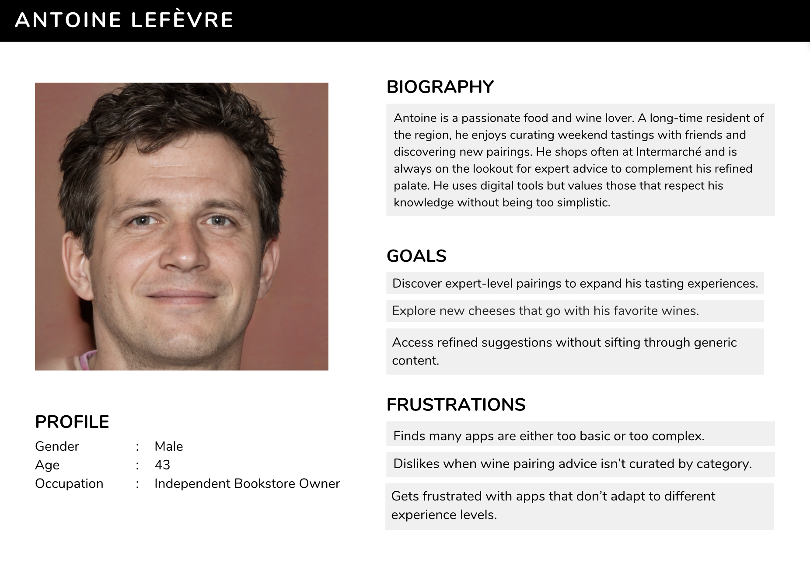

 

  <h1 align="center">Functional Specifications</h1>
  

    <strong>Bubble Intermarché - Team 6</strong>
     
  
  

<b>📖 Table of Contents</b>

- [1. Introduction](#1-introduction)
  - [1.1. Project Overview](#11-project-overview)
  - [1.2. Project Definition](#12-project-definition)
    - [1.2.1. Project Context](#121-project-context)
    - [1.2.2. Project Scope](#122-project-scope)
    - [1.2.3. Target Audience](#123-target-audience)
  - [1.3. Project Organization](#13-project-organization)
    - [1.3.1. Project Team](#131-project-team)
    - [1.3.2. Stakeholders](#132-stakeholders)
  - [1.4. Project Timeline](#14-project-timeline)
- [2. Persona / Use Cases](#2-persona--use-cases)
  - [2.1. Persona](#21-persona)
    - [2.1.1. Luca](#211-luca)
    - [2.1.2. Claire](#212-claire)
    - [2.1.3. Antoine](#213-antoine)
  - [2.2. Use Cases](#22-use-cases)
    - [2.2.1. Cheese to Wine recommendation](#221-cheese-to-wine-recommendation)
    - [2.2.2. Dish to Cheese recommendation](#222-dish-to-cheese-recommendation)
    - [2.2.3. Wine to Cheese recommendation](#223-wine-to-cheese-recommendation)
- [3. Functional Requirements](#3-functional-requirements)
  - [3.1. Global User Flow](#31-global-user-flow)
  - [3.2. Visual Design](#32-visual-design)
    - [3.2.1. Color Palette](#321-color-palette)
  - [3.3. Product Detail View](#33-product-detail-view)
  - [3.4. Homepage & Navigation](#34-homepage--navigation)
  - [3.5. Favorites Page](#35-favorites-page)

## 1. Introduction

### 1.1. Project Overview

Our web application is designed to enhance the customer experience at Intermarché by helping users find the perfect wine and cheese pairings. The app guides users through a smooth, decision-tree-based flow where they can start from a dish, a cheese, or a wine and receive tailored recommendations.

The application will guide users through a series of simple and user-friendly steps that simulate sommelier-like expertise. Depending on the user’s input (dish, wine, or cheese), the app will return the most appropriate product matches. It supports both casual users looking for inspiration and gourmet shoppers seeking the perfect pairing.

### 1.2. Project Definition

### 1.2.1. Project Context

Saint Remy de Provence's Intermarché is a local grocery store that offers a wide range of products, including wine and cheese. The store is known for having a large amount of foreigner customers, especially during the summer months. The store's wine and cheese section is particularly popular, but customers often struggle to find the perfect pairing. **This is where our application comes in.**

### 1.2.2. Project Scope

This project is a Proof of Concept (PoC) for a web application and will focus on the following key features:

- 🤝 **User-Friendly Interface**: The application should be intuitive and easy to navigate, allowing users to find wine and cheese pairings quickly.

- ⚙️ **Enhanced Customer Experience**: By providing tailored recommendations, the app aims to improve customer satisfaction and encourage repeat visits to Intermarché.

- 🍷🧀 **Wine and Cheese Matching**: The application will match wines and cheeses based on user input, providing a seamless experience for users looking to enhance their meals.

### 1.2.3. Target Audience

- 👤 **Local Customers**: Regular shoppers at Intermarché who are looking for quick and easy pairing suggestions.

- 👥 **Tourists**: Visitors to Saint Remy de Provence who may be unfamiliar with local products and are looking for recommendations.

- 👨‍🍳 **Food Enthusiasts**: Individuals who are passionate about food and wine pairings and are looking for expert advice.

- 🤵‍♂️ **Dinner Hosts**: People planning special occasions or dinner parties who want to impress their guests with the perfect wine and cheese pairings.

## 1.3. Project Organization

### 1.3.1. Project Team

| Name | Role | Responsibilities | Socials |
|------|------|------------------|------------------|
| Alexandre BOPP | Project Manager | Oversees project development, manage timelines, and coordinate team efforts. | [LinkedIn](https://www.linkedin.com/in/alexandre-bopp-682a97250/)|
| Victor LEROY | Program Manager | Manages the functional aspects of the project, including user interface and user experience. | [LinkedIn](https://www.linkedin.com/in/victorleroy18/) |
| Habi CAILLEAU | Technical Lead | Leads the technical development of the application, ensuring best practices are followed. Responsible for writing the technical specifications document. | [LinkedIn](https://www.linkedin.com/in/habi-cailleau-3b72b5293/) |
| Axel DAVID | Software Engineer | Develops the web application, implement features. | [LinkedIn](https://www.linkedin.com/in/axel-david-6384bb32a/) |
| Enzo GUILLOUCHE | QA Engineer | Responsible for testing the application, ensuring it meets quality standards and is free of bugs. | [LinkedIn](https://www.linkedin.com/in/enzoguillouche/) |

### 1.3.2. Stakeholders

| Name | Role | Responsibilities |
|------|------|------------------|
| Intermarché | Client | Provides the project requirements and feedback. |

## 1.4. Project Timeline

| Date | Milestone | Description |
|------|-----------|-------------|
| 04/23/2025 | Project Kickoff | Initial meeting to discuss project goals and objectives. |
| 05/16/2025 | Functional Specifications | Completion of the functional specifications document. |
| 05/28/2025 | Technical Specifications | Completion of the technical specifications document. |
| 06/06/2025 | Test Plan | Completion of the test plan document. |
| 06/16/2025 | First Prototype | Delivery of the first prototype of the application. |

## 2. Persona / Use Cases

### 2.1. Persona

#### 2.1.1. Luca

#### 2.1.2. Claire

#### 2.1.3. Antoine

## 2.2. Use Cases

### 2.2.1. Cheese to Wine recommendation

**Description**:  
While browsing in Intermarché, Luca picks up a regional cheese (e.g., “Tomme de Provence”) and wants to find a wine that complements it. Since he’s unfamiliar with French cheeses and doesn’t speak the language fluently, he uses the app to get a simple, local wine recommendation that will pair well and represent the region.

**Normal Flow**:  
1. Luca selects “Start from a Cheese” on the app homepage.  
2. He types the name of the cheese or selects it from a visual list (e.g., “Tomme de Provence”).  
3. The system retrieves pairing data for that cheese.  
4. The app displays a curated list of wines that pair well with it.  
5. The app highlights the best local or regional match.  
6. Luca optionally explores wine descriptions and price ranges.

**Alternative Flows**:  
- 2A. Cheese not recognized → App suggests similar cheeses or allows visual selection from categories (e.g., soft, hard, goat).  
- 5A. No local wine match → App suggests the next-best national pairing.

**Postconditions**:  
Luca receives a tailored wine suggestion that complements his selected cheese, with a focus on local/regional options.

### 2.2.2. Dish to Cheese recommendation

**Description**:  
Claire is preparing a meal for guests and wants to find the perfect cheese to accompany the dish. She uses the app to input the name of her dish (e.g., “coq au vin”). The system identifies the dish type (e.g., meat) and offers relevant cheese pairings. Claire can view similar cheeses and receive the best match to impress her guests.

**Normal Flow**:  
1. Claire selects “Start from a Dish” on the homepage.  
2. She types in the name of her planned dish (e.g., “ratatouille”).  
3. The system classifies the dish as vegetable-based.  
4. Claire chooses to receive cheese recommendations.  
5. The app displays a curated list of cheeses that match vegetable-based dishes.  
6. The app highlights the best match for the selected dish.  
7. Claire optionally explores similar cheese options.

**Alternative Flow**:  
- 2A. The dish is not recognized → The app offers a dropdown of predefined dishes or suggests editing the input.  

**Postconditions**:  
Claire receives one or more cheese recommendations tailored to her dish, helping her prepare a well-matched meal.

### 2.2.3. Wine to Cheese recommendation

**Description**:  
Antoine is planning a tasting evening and starts with a wine he enjoys (e.g., “Châteauneuf-du-Pape”). He uses the app to receive expert-level cheese recommendations that pair well with the selected wine. He also wants to explore a few similar pairing ideas for variety.

**Normal Flow**:  
1. Antoine selects “Start from a Wine” on the homepage.  
2. He inputs the name of his wine or selects it from a curated list.  
3. The system fetches pairing rules based on wine type (e.g., red, bold, Rhône Valley).  
4. The app displays recommended cheeses that match the wine.  
5. The app highlights a top pairing and offers 2–3 alternative cheese options.  
6. Antoine can tap any cheese to view flavor notes, textures, and suggested occasions.

**Alternative Flows**:  
- 2A. Wine not recognized → App prompts user to select a wine category (e.g., red/bold/dry) instead.  
- 4A. No cheese match → App shows generic pairings for similar wine styles.

**Postconditions**:  
Antoine receives a cheese pairing that complements his wine and expands his tasting experience, with optional deep-dives into flavor and origin.

## 3. Functional Requirements

### 3.1 Global User Flow

The flowchart below provides an overview of the app’s core decision-making logic, from homepage to final recommendation.

*(As the diagram is quite detailed, it is recommended to zoom in for better readability.)*

### 3.2. Visual Design

To create our mockups, we used Figma, a collaborative design tool that allows for easy sharing and feedback. The mockups are designed to be visually appealing and user-friendly, with a focus on simplicity and ease of navigation.

Here is the link to the Figma file: [Figma Mockups](https://www.figma.com/design/wQ7NaObzJ04TrvweCbxS5Z/Intermarch%C3%A9?node-id=0-1&t=2GPKpLDiJrA0HViY-1)

---

#### 3.2.1 Color Palette

The color palette was designed to balance brand recognition, visual clarity, and mobile usability — especially for in-store browsing scenarios.

##### Primary Colors

- **Bright Red** **(#FF0000)**  
Chosen as the primary accent color, used for key interactive elements such as the active menu icon or call-to-action buttons. While our initial intention was to use **Intermarché’s official red**, we found that it did not render well across all devices and backgrounds. #FF0000 offered stronger contrast, better visibility on white and grey backgrounds, and preserved the strong, energetic identity associated with the Intermarché brand.

- **Dark Grey** **(#868686)**  
Used for headers, borders, and the top bar background. This neutral tone provides depth and separates UI elements without overwhelming the design.

##### Neutrals & Backgrounds

- **White** **(#FFFFFF)**  
Serves as the primary background to ensure maximum contrast with product images and text.

- **Light Grey** **(#DEDEDE)**  
Used for inactive elements, search bars, and separators to maintain visual structure without adding clutter.

##### Accent Colors

- **Gold-Yellow** **(#E9BC08)**  
Used for the “favorite” star icon. It evokes the idea of personal curation and premium selection, tying into the gourmet nature of the app.

The final palette ensures a clean, professional appearance while optimizing for **legibility, usability**, and **emotional impact**, particularly in a retail environment.

### 3.3 Homepage & Navigation

The homepage is the user’s first touchpoint with the app and serves as the launchpad for product discovery. It allows users to search for cheeses or wines, view best-selling items, and navigate to core features like Favorites and Settings.

#### Visual Structure

The screen is divided into three key zones:

1. **Search Bar (Top)**
   - A prominent input field labeled “Rechercher un produit...” allows users to search for a cheese or wine by name.
   - The search field includes a magnifying glass icon for intuitive interaction.
   - Designed to be large and accessible on mobile screens.

2. **Best Sellers Section (Middle)**
   - Below the search bar, a heading “Meilleures ventes” introduces a curated product list.
   - Two filter buttons (“Fromages” and “Vins”) let the user toggle the product type.
     - When “Fromages” is active, the list shows best-selling cheeses.
     - When “Vins” is active, the list displays top-selling wines.
   - Each product is shown in a horizontal card layout:
     - Product image
     - Name
     - Tags (e.g., “Onctueux”, “Délicat”, “Fruité”, etc.)
     - Price (€/kg for cheese, €/bottle for wine)
     - A star icon that allows users to **favorite** the item

3. **Bottom Navigation Bar**
   - Fixed and accessible at all times.
   - Includes three main actions:
     - 🏠 **Menu**: Returns to the homepage (highlighted in red when active)
     - ⭐ **Favoris**: Takes users to their saved favorites
     - ⚙️ **Paramètres**: Opens the settings screen

> [!CAUTION]
> The following visual will be used as a reference for the homepage design. The language will be in French, because the mockups are sent to the client for review/feedback. The final version will be in both French and English, as per the requirements.

#### Functional Expectations

- The homepage must always reflect the most recent product data (e.g., stock, price).
- Tapping a product card should lead to a **Product Detail View**.
- The “Fromages” and “Vins” buttons act as **client-side filters**, not page reloads.
- Favoriting an item should persist across sessions and be retrievable from the “Favoris” tab.
- All elements must be optimized for mobile — spacing, font size, and tap zones must meet mobile UX standards.

#### Accessibility & Language

- The interface must be fully available in **French and English**.
- Language selection will be handled in the Settings page.
- Product tags (like “Délicat” or “Corsé”) will be used to enhance the user experience and help users find products that match their preferences. Users can filter products based on these tags, and do searches using them.

#### Example User Flow

1. A user opens the app and sees the homepage with “Fromages” preselected.
2. They browse the list and tap the star next to “Comté 18 mois” to add it to favorites.
3. They tap “Vins” to switch the list and view wine suggestions.
4. They tap a wine to view more details and matching suggestions.

### 3.4 Product Detail View

This screen provides users with an in-depth look at a selected product (wine or cheese), including its characteristics, description, and pairing suggestions. It’s a key part of the user journey, especially for those making in-store decisions or exploring expert recommendations.

#### Visual Structure

1. **Header Zone**
   - A back arrow allows the user to return to the previous screen.
   - A star icon in the top-right corner lets the user favorite the item for quick access later.
   - The background bar is styled in grey to visually separate the header from the content area.

2. **Product Overview**
   - Large product image (e.g. wine bottle or cheese block)
   - Product name in bold (e.g. *Vin Rosé IGP Alpilles*)
   - Attribute tags (e.g. “Délicat”, “Frais”) displayed as rounded badges
   - Quick facts:
     - **Price** (€/kg for cheese, €/bottle for wine)
     - **Ideal usage** (e.g. “Idéal pour : Apéritifs”)
     - **Volume and alcohol level** for wines (e.g. “12.5% vol, 0,75l”)

3. **Description Section**
   - A paragraph of rich text that tells the story of the product:
     - Origin or brand
     - Flavor profile
     - Recommended occasions
     - Food pairings or traditions

4. **Pairing Recommendations**
   - Section title: **"Se marie bien avec"**
   - Horizontally scrollable card layout featuring matching items:
     - Cheese or dish image
     - Name of the item (e.g. “Camembert”, “Ratatouille”)
     - Optional tags or notes (if applicable)

5. **Bottom Navigation Bar**
   - Consistent with other screens:
     - **Menu**, **Favoris**, **Paramètres**

> [!CAUTION]
> The following visual will be used as a reference for the product detail view design. The language will be in French, because the mockups are sent to the client for review/feedback. The final version will be in both French and English, as per the requirements.

#### Functional Expectations

- Users must be able to **favorite** or **unfavorite** the product by tapping the star icon.
- Clicking on a pairing suggestion (e.g., “Camembert”) should open its own product detail view.
- Product information (description, tags, pairings) should be **fetched dynamically** based on the selected item.
- Tags and descriptions must **adapt based on language selection** (EN/FR).
- Descriptions must be **scrollable** if they exceed the screen height.

#### Example User Flow

1. A user taps “Vin Rosé IGP Alpilles” from the homepage wine list.
2. They are redirected to the Product Detail View.
3. They read about the wine’s characteristics and see that it pairs well with Camembert and Ceviche.
4. They tap the star to add it to favorites.
5. They scroll horizontally to view all pairing suggestions.
6. They tap “Camembert” to learn more about it.

### 3.5 Favorites Page

The “Favoris” page allows users to view all previously saved items — both cheeses and wines — that they marked with the ⭐ icon. It acts as a personal shortlist for users who want to revisit their selections, especially when they’re actively shopping or planning meals.

#### Visual Structure

1. **Header**
   - Title displayed at the top of the screen: **“Mes favoris”**
   - Clean white background for consistency with other pages

2. **Favorites List**
   - Items are displayed as vertical cards, consistent with the homepage
   - Each card includes:
     - Product image (left-aligned)
     - Product name (bold, top-right)
     - Attribute tags (e.g. “Délicat”, “Corsé”) shown below the name
     - Contextual description:
       - For wine: “Idéal pour : [Apéritifs / Repas / etc.]”
       - For cheese: none or optional pairing note
     - Price (€/kg for cheese, €/bottle for wine) aligned bottom-right
     - A filled gold ⭐ icon in the top-right corner to indicate it’s favorited

3. **Bottom Navigation Bar**
   - Highlights the **“Favoris”** tab in red when active
   - Users can switch to **Menu** or **Paramètres** at any time

> [!CAUTION]
> The following visual will be used as a reference for the favorites page design. The language will be in French, because the mockups are sent to the client for review/feedback. The final version will be in both French and English, as per the requirements.

#### Functional Behavior

- The list must include **both wines and cheeses**, displayed in the order they were favorited (most recent first).
- Tapping a product card should open its **Product Detail View** (see Section 3.3).
- Tapping the filled star icon removes the item from the favorites list.
  - The item should disappear immediately via smooth animation.
- If no items are saved, display an empty state message such as:
  > “Vous n'avez pas encore ajouté de favoris.”  
  > *(“You haven’t added any favorites yet.”)*

#### Example User Flow

1. The user taps the ⭐ “Favoris” icon in the bottom navigation.
2. They see four saved products: two cheeses and two wines.
3. They scroll through the list and tap “Vin Rosé IGP Alpilles.”
4. The app navigates to the detailed view for that wine.
5. They return and tap the ⭐ next to “Morbier” to remove it from favorites.
6. The item disappears from the list instantly.
