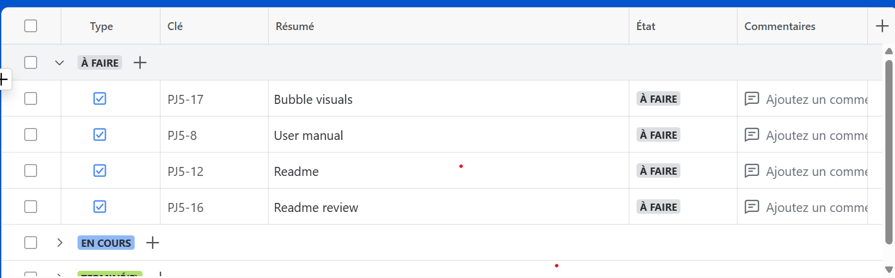
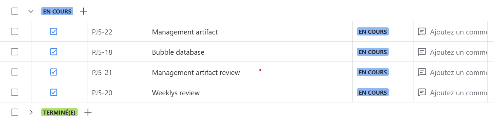
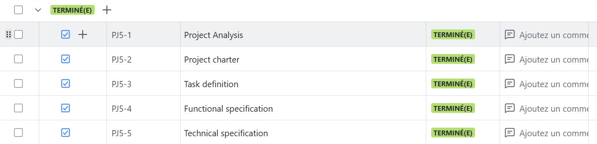
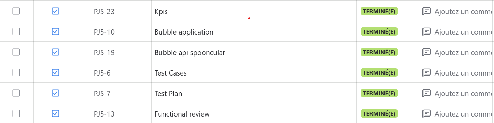
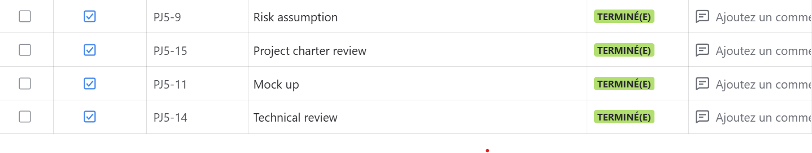
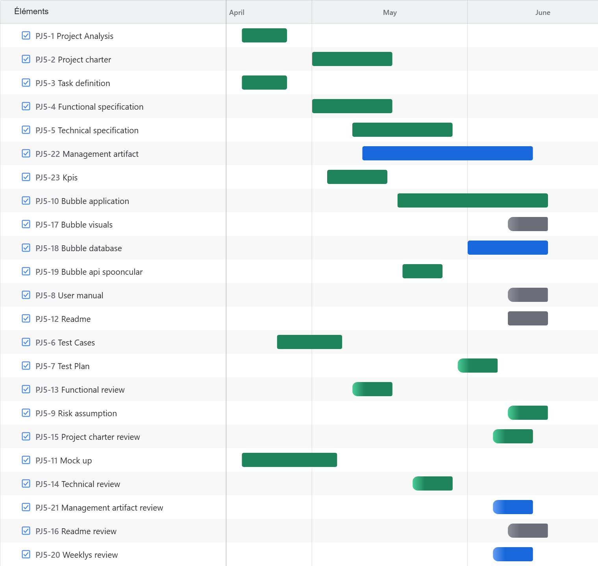

# 📘 Management Artifacts – Team 5: Bubble Project

## Document Overview

| **Description**  | **Information**        |
|------------------|------------------------|
| Document Owner   | Alexandre Bopp         |
| Creation Date    | May 24, 2025           |
| Last Updated     | June 12, 2025          |

---

- [📘 Management Artifacts – Team 5: Bubble Project](#-management-artifacts--team-5-bubble-project)
  - [Document Overview](#document-overview)
  - [🗂️ Tasks \& Timeline](#️-tasks--timeline)
    - [To Do](#to-do)
    - [In Progress](#in-progress)
    - [Done](#done)
  - [📊 Gantt Chart](#-gantt-chart)
  - [👥 RACI Matrix](#-raci-matrix)
  - [✅ MoSCoW Prioritization](#-moscow-prioritization)
  - [⚠️ Risks and Assumptions](#️-risks-and-assumptions)
  - [📈 Key Performance Indicators (KPIs)](#-key-performance-indicators-kpis)
    - [1. Documentation Progress](#1-documentation-progress)
    - [2. Development KPIs](#2-development-kpis)
    - [3. Testing \& Quality Metrics](#3-testing--quality-metrics)
    - [4. Team Metrics](#4-team-metrics)
  - [🧾 Weekly Reports](#-weekly-reports)
  - [📌 Conclusion](#-conclusion)

---

## 🗂️ Tasks & Timeline

Project management activities are conducted via **Jira**, with task tracking organized into three categories: *To Do*, *In Progress*, and *Done*. Each task is detailed with its title, assignee, due date, and status.

Due to access restrictions, Jira cannot be publicly shared via link. Screenshots have been provided as an overview of the project task board.

### To Do

### In Progress

### Done

---

## 📊 Gantt Chart

A Gantt chart provides a visual timeline of project phases, key milestones, and task dependencies. This chart allows stakeholders to easily track progress and manage deadlines.

---

## 👥 RACI Matrix

The RACI matrix defines the roles and responsibilities of team members across key activities:

| **Activity**               | **Project Manager** | **Tech Lead** | **Developers** | **QA** | **Tech Writer** |
|----------------------------|---------------------|---------------|----------------|--------|------------------|
| Planning & Scheduling      | R                   | C             | I              | I      | I                |
| Functional Documentation   | R                   | C             | I              | C      | I                |
| Technical Specification    | I                   | R             | A              | C      | I                |
| Bubble App Development     | I                   | R             | A              | C      | I                |
| API Development            | C                   | R             | A              | C      | I                |
| QA & Bug Tracking          | C                   | C             | R              | A      | I                |
| Performance Optimization   | I                   | R             | A              | C      | I                |
| User Documentation         | I                   | C             | I              | C      | R                |
| Final Delivery             | R                   | C             | A              | A      | C                |

**Key Definitions**:

- **R = Responsible**: Owns the work.
- **A = Accountable**: Ultimately answerable for the activity.
- **C = Consulted**: Provides input or expertise.
- **I = Informed**: Kept up to date on progress.

---

## ✅ MoSCoW Prioritization

Tasks are prioritized using the MoSCoW method (Must, Should, Could, Won’t):

| **Must Have**                     | **Should Have**             | **Could Have**               | **Won’t Have**      |
|----------------------------------|-----------------------------|------------------------------|---------------------|
| Core Bubble Application          | CSV Import (Trial Mode)     | UI/UX Styling Improvements   | Admin Dashboard     |
| Wine & Dish Selection Interface  | User Feedback Mechanism     | Extended API Integration     | Full Production     |
| Basic Manual Test Plan           | Test Automation Scripts     | Data Export Functionality    |                     |

---

## ⚠️ Risks and Assumptions

| **Item**                                      | **Type**     | **Impact** | **Response Strategy**                                                                 |
|-----------------------------------------------|--------------|------------|----------------------------------------------------------------------------------------|
| Limited Bubble Platform Capabilities          | Risk         | High       | Enable trial mode to unlock necessary features and plan around platform constraints.  |
| Incomplete Initial Documentation              | Risk         | Medium     | Conduct regular documentation reviews and update continuously during development.     |
| Team's Lack of Bubble Experience              | Risk         | High       | Organize internal onboarding, documentation reviews, and pair programming sessions.   |
| Time Constraints (Holidays, Exams)            | Risk         | Medium     | Proactively adjust the timeline and distribute workload evenly to prevent bottlenecks.|
| Early Departure of a Developer                | Risk         | High       | Redistribute initial responsibilities across the team; revise scope and planning.     |
| Overcommitment Risk                           | Risk         | Medium     | Avoid burnout by limiting overtime and encouraging sustainable pacing.                |
| Long Project Timeline                         | Assumption   | High       | Use the extended timeline to plan thoroughly and focus on quality over speed.         |
| Dataset Availability and Suitability          | Assumption   | Medium     | Validate datasets early and ensure compatibility with the application logic.          |
| Access to Bubble Trial Features               | Assumption   | High       | Confirm access to premium features early to prevent unexpected limitations.           |

---

## 📈 Key Performance Indicators (KPIs)

### 1. Documentation Progress

Tracks the completion of all project documentation (Functional Spec, Tech Spec, Test Plan, User Guide).

- Functional Specification
- Technical Specification
- Test Plan
- User Guide

**Formula:**
$\text{Progress (\%)} = \frac{\text{Completed Sections}}{\text{Total Sections}} \times 100$

---

### 2. Development KPIs

Tracks progress in software features:

- Bubble App Core Features
- Dish & Wine Selection Logic
- CSV Import Integration

**Formula:**
$\text{Progress (\%)} = \frac{\text{Completed Tasks + Partial Completion}}{\text{Total Tasks}} \times 100$

---

### 3. Testing & Quality Metrics

**Bug Fix Rate**
$\text{Bug Fix Rate (\%)} = \frac{\text{Fixed Bugs}}{\text{Reported Bugs}} \times 100$

**Test Completion Rate**
$\text{Completion Rate (\%)} = \frac{\text{Executed Tests}}{\text{Planned Tests}} \times 100$

---

### 4. Team Metrics

**Mood Score**
$\text{Mood Score} = \frac{\sum \text{Team Ratings}}{\text{Number of Team Members}}$

Mood is self-reported weekly on a scale from 1 to 10.

---

## 🧾 Weekly Reports

Project progress was reviewed in weekly meetings. Reports include:

- Weekly objectives and actual outcomes
- Tasks completed/in progress
- Issues and resolutions

**Access Reports:**
- [Weekly Report 1](https://github.com/algosup/2024-2025-project-5-bubble-intermarche-team-6/blob/management/Documents/Management/WeeklyReports/weekly_report_1.md)
- [Weekly Report 2](https://github.com/algosup/2024-2025-project-5-bubble-intermarche-team-6/blob/management/Documents/Management/WeeklyReports/weekly_report_2.md)
- [Weekly Report 3](https://github.com/algosup/2024-2025-project-5-bubble-intermarche-team-6/blob/management/Documents/Management/WeeklyReports/weekly_report_3.md)
- [Weekly Report 4](https://github.com/algosup/2024-2025-project-5-bubble-intermarche-team-6/blob/management/Documents/Management/WeeklyReports/weekly_report_4.md)
- [Weekly Report 5](https://github.com/algosup/2024-2025-project-5-bubble-intermarche-team-6/blob/management/Documents/Management/WeeklyReports/weekly_report_5.md)
- [Weekly Report 6](https://github.com/algosup/2024-2025-project-5-bubble-intermarche-team-6/blob/management/Documents/Management/WeeklyReports/weekly_report_6.md)
- [Weekly Report 7](https://github.com/algosup/2024-2025-project-5-bubble-intermarche-team-6/blob/management/Documents/Management/WeeklyReports/weekly_report_7.md)
- [Weekly Report 8](https://github.com/algosup/2024-2025-project-5-bubble-intermarche-team-6/blob/management/Documents/Management/WeeklyReports/weekly_report_8.md)
- [Weekly Report 9](https://github.com/algosup/2024-2025-project-5-bubble-intermarche-team-6/blob/management/Documents/Management/WeeklyReports/weekly_report_9.md)

**Cumulative Summary:**
- [Cumulative Overview](https://github.com/algosup/2024-2025-project-5-bubble-intermarche-team-6/blob/management/Documents/Management/WeeklyReports/cumulative.md)

---

## 📌 Conclusion

This document consolidates all essential management artifacts for the Bubble Project, ensuring visibility, alignment, and transparency across team activities and deliverables. It serves as a living reference for stakeholders to track progress, understand responsibilities, and make informed decisions throughout the project lifecycle.
