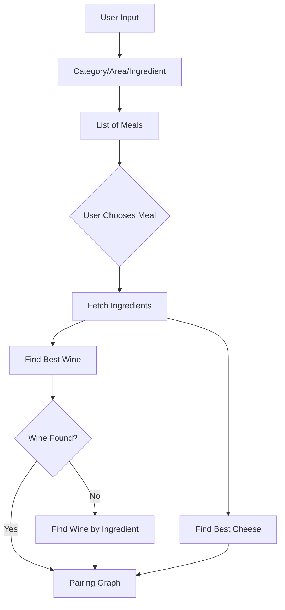
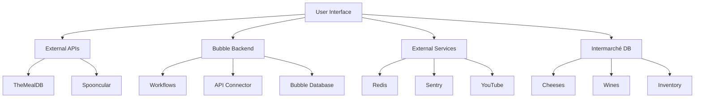
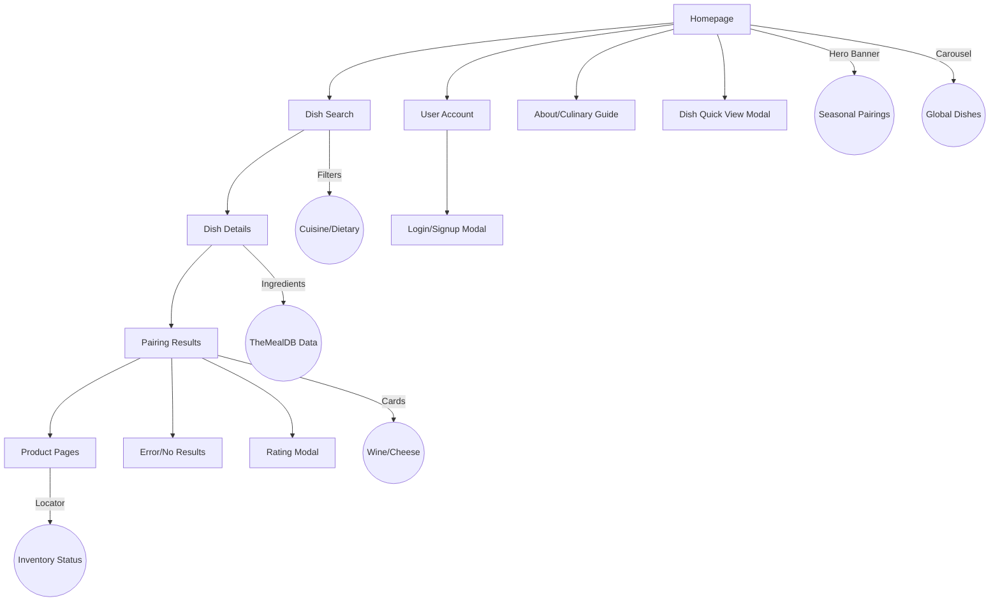

# Technical Specification Document Architecture

### 1. Introduction  

#### 1.1 Project Context  
This project is commissioned by Intermarché, a leading French supermarket chain, to enhance the culinary experience of its customers by simplifying the pairing of cheeses and wines with their dishes. Cheese and wine are integral to French gastronomy, but selecting the right combinations can be challenging for both casual consumers and enthusiasts. The web application will leverage Intermarché’s existing database of cheeses and wines to provide tailored recommendations, ensuring alignment with the retailer’s product offerings. Built on Bubble.io, the platform will prioritize speed, accessibility, and ease of use, catering to users across devices.

#### 1.2 Objectives
The primary objectives of the project are:  
- **Pairing Algorithm**: Develop a data-driven recommendation system that suggests optimal cheese and wine pairings based on the user’s selected dish.
- **User-Centric Design**: Create an intuitive interface that allows users to filter recommendations by criteria such as cheese type, wine region, flavor intensity, and dietary preferences.
- **Database Integration**: Seamlessly integrate Intermarché’s product database to ensure recommendations reflect real-time availability and inventory.  
- **Scalability**: Design the architecture to accommodate future expansions, such as adding new product categories or regional specialties.  


### 2. Functional Requirements
#### 2.1 Key Features  

##### 2.1.1 Recommendation System (Cheese/Wine Based on Dish)
- **Mechanics**:  
  - **Spooncular Integration**:  
    - When a user selects a dish, the app extracts its name using TheMealDB’s `lookup.php?i={meal_id}` endpoint.  
    - Send meal name (e.g., `["migas"]`) to Spooncular’s `GET /food/wine/pairing` endpoint.  
    - Example API Call:  
      ```json
      {
        "Meal": ["migas"],
        "maxResults": 1
      }
      ```  
  - **Fallback Logic**:  
    - If Spooncular returns no matches (e.g., `{"pairedWines": []}`), use the dominant ingredient (e.g., *"mushrooms"*) to query Spooncular’s `GET /food/wine/ingredient` endpoint.  
    - Only use wines/cheeses from Intermarché’s inventory in results.  
  - **Inventory Filtering**:  
    - Cross-reference Spooncular’s suggestions with Intermarché’s database to remove out-of-stock items.  
- **Output**:  
  - Display pairing rationale (e.g., *“Pinot Noir complements earthy mushroom flavors”*).  
  - Show *“Why This Works”* cards with flavor profile matches (e.g., acidity, tannin levels).  


##### 2.1.2 Search Interface
- **Dish Search**:  
  - **Auto-Complete**:  
    - Query TheMealDB’s `search.php?s={query}` endpoint as users type (e.g., typing *“bouill”* suggests *“Bouillabaisse”*).  
    - Display dish thumbnails, region, and cooking time from TheMealDB.  
  - **Ingredient Filtering**:  
    - Allow users to exclude ingredients (e.g., *“Vegan"*) to refine Spooncular’s pairings.  
  - **Category Filters**:  
    - Use TheMealDB’s `category.php` endpoint to populate filters (e.g., *“Seafood”*, *“Vegetarian”*).  


##### 2.1.3 API Integrations  
- **TheMealDB**:  
  - **Scope**:  
    - Fetch full meal details via `lookup.php?i={id}` (includes YouTube tutorials, ingredient lists).  
    - Cache responses for 24 hours to reduce API calls.  
  - **Authentication**: Public API key (no authentication required).  
  - **Rate Limits**: 100 requests/hour (free tier).  
- **Spooncular**:  
  - **Endpoints**:  
    - `/food/wine/pairing`: Returns top 3 wines/cheeses for a dish.  
    - `/food/wine/ingredient`: Fallback for ingredient-based pairings.  
  - **Authentication**: API key stored in Bubble.io’s encrypted environment variables.  
  - **Rate Limits**: 150 requests/day (free tier) – trigger alerts at 80% usage.  
  - **Error Handling**:  
    - If Spooncular is unavailable, default to rule-based pairings (e.g., *“Regional Matches”* from Intermarché’s database).  




This diagram illustrates the user journey from input to pairing results, including fallback logic. It directly maps to the Recommendation System and API Integrations described in Sections 2.1.1 and 2.1.3.


### 3. Technical Architecture

#### 3.1 Platform: Bubble.io

##### 3.1.1 Automated Workflows  
- **Dish Selection Workflow**:  
  1. **User Selects Dish**:  
     - Trigger: User clicks a dish card (e.g., *"Coq au Vin"*) from TheMealDB-powered search results.  
     - Action: Fetch meal details using TheMealDB’s `lookup.php?i={meal_id}` endpoint.  
  2. **Ingredient Extraction**:  
     - Parse the JSON response to extract `strIngredient1` to `strIngredient20` fields.  
     - Filter out generic ingredients (e.g., *"salt"*, *"water"*) to focus on flavor drivers (e.g., *"thyme"*, *"red wine"*).  
  3. **Spooncular API Call**:  
     - Send cleaned ingredients to Spooncular’s `/food/wine/pairing` endpoint via POST request.  
     - Handle API errors (e.g., timeouts) with retries (max 3 attempts).  
  4. **Inventory Check**:  
     - Compare Spooncular’s suggested wines/cheeses against Intermarché’s database using `Inventory_ID`.  
     - Remove items where `Inventory_Status = "out_of_stock"`.  
  5. **Display Results**:  
     - Show top 3 available pairings with `Spooncular_Score` > 80%.  
     - Add *“Alternative Pairings”* section if fewer than 3 results exist.  

##### 3.1.2 API Integrations
- **TheMealDB**:  
  - **Setup**:  
    - Use Bubble’s native **API Connector** with base URL `https://www.themealdb.com/api/json/v1/1/`.  
    - Public API key added to headers: `{ "Authorization": "Bearer {public_key}" }`.  
  - **Caching**:  
    - Cache meal metadata (names, thumbnails) for 24 hours to reduce latency.  
    - Disable caching for real-time data (e.g., user-generated recipe ratings).  
  - **Rate Limits**:  
    - Alert admins via email if usage exceeds 90% of the 100-requests/hour limit.  

- **Spooncular**:  
  - **Authentication**:  
    - Store API key in Bubble’s **Environment Variables** (encrypted).  
    - Add to headers: `{ "X-API-Key": "{spooncular_key}" }`.  
  - **Rate Limits**:  
    - Track usage via a custom `API_Calls` log collection (timestamp, endpoint, status).  
    - Throttle requests during peak hours to stay under 150/day.  
  - **Fallback**:  
    - If Spooncular fails, default to Intermarché’s static pairing rules (e.g., *“Bordeaux wines with hard cheeses”*).  


#### 3.2 Data Model

##### 3.2.1 Collections
- **Dishes Collection**:  
  - **New Fields**:  
    - `MealDB_ID` (String): Unique identifier from TheMealDB (e.g., *"52772"* for Coq au Vin).  
    - `Dominant_Ingredient` (String): Primary flavor driver identified by Spooncular (e.g., *"garlic"*).  

- **Pairings Collection**:  
  - **New Fields**:  
    - `Spooncular_Score` (Number 0-100): Confidence level from API (e.g., *85* = strong match).  
    - `Ingredient_Matches` (List): Ingredients driving the pairing (e.g., *["mushrooms", "thyme"]*).  

##### 3.2.2 Relationships & Optimization
- **Enhanced Relationships**:  
  - `Dishes.MealDB_ID` ↔ `Pairings.Dish_ID` (ensures traceability to TheMealDB).  
  - `Pairings.Wine_IDs` ↔ `Wines.Wine_ID` (enforce referential integrity).  
- **Indexing**:  
  - Add indexes to `Spooncular_Score` and `Inventory_Status` for faster filtering.  
- **Data Validation**:  
  - Automatically flag pairings with `Spooncular_Score < 50` for admin review.  





This high-level architecture diagram visualizes the system components described in Sections 3.1 (Bubble.io workflows) and 3.2 (data model). It clarifies how external services, APIs, and databases interact.


### 4.User Interface (UI/UX)
#### 4.1 Screen Mockups

##### 4.1.1 Homepage
- **Layout Updates**:  
  - **Hero Section**: Retains promotional banners (e.g., *“Seasonal Pairings”*) and includes a dynamic carousel below.  
  - **“Explore Global Dishes” Carousel**:  
    - **Data Source**: Pulls trending dishes from TheMealDB (e.g., *Paella, Sushi, Moussaka*).  
    - **Design**:  
      - Horizontal scroll with 5-7 cards visible on desktop, 2 on mobile.  
      - Each card includes:  
        - Dish thumbnail (from TheMealDB’s `strMealThumb`).  
        - Dish name and cuisine type (e.g., *“Spanish”* for Paella).  
        - Quick-action button: *“Pair Now”* to jump to recommendations.  
    - **Interactivity**:  
      - Auto-scroll every 10 seconds (paused on hover).  
      - Clicking a card opens a modal with dish details (ingredients, cooking time).  

---

##### 4.1.2 Product Page  
- **Pairing Section Redesign**:  
  - **“Why This Pairing Works” Card**:  
    - **Content**:  
      - Header: *“The Science of Flavor”* with a wine/cheese icon.  
      - Body: Spooncular’s `pairingText` (e.g., *“The tannins in Cabernet Sauvignon cut through the richness of Camembert”*).  
      - **Ingredient Overlap**:  
        - Bullet list of shared ingredients/flavors (e.g., *“Rosemary”*, *“Black Pepper”*).  
        - Visual indicator: Matching ingredients highlighted in green.  
    - **Design**:  
      - Light-gray background with a border-radius for soft edges.  
      - “Learn More” link to expand flavor profile charts (e.g., acidity vs. fat).  
  - **Visual Enhancements**:  
    - **Wine/Cheese Cards**:  
      - Display Intermarché’s product image, price, and *“In Stock”* badge.  
      - Hover effect: Show tasting notes (e.g., *“Earthy with hints of plum”*).  
    - **Fallback Pairings**:  
      - If ingredient overlap is low, show *“Alternative Pairings”* with Intermarché’s regional matches.  

---

#### 4.2 User Experience 
- **Accessibility**:  
  - **Carousel**: ARIA labels for screen readers (e.g., *“Explore Global Dishes carousel, item 1 of 5”*).  
  - **Alt Text**: Auto-generated for TheMealDB images (e.g., *“Paella with seafood and saffron rice”*).  
- **Performance**:  
  - Lazy-load carousel images to reduce initial page load time.  
  - Cache Spooncular’s `pairingText` for 1 hour to minimize API calls.  
- **Error States**:  
  - If TheMealDB fails, show a placeholder carousel with Intermarché’s curated dishes.  
  - If `pairingText` is empty, display *“Our sommeliers recommend this pairing for its balanced flavors.”*  





This page flow diagram aligns with Sections 4.1 (Screen Mockups) and 4.2 (User Experience). It shows how users navigate between core pages and modals.


### 5. Data Management  

#### 5.1 Data Sources

**TheMealDB Integration**  
- **Daily Sync Process**:  
  - **Automated Workflow**:  
    - Run nightly via Bubble.io’s scheduler to fetch new/updated dishes from TheMealDB’s `latest.php` endpoint.  
    - Compare `MealDB_ID` with existing records to avoid duplicates.  
  - **Data Mapping**:  
    - Transform API responses into the `Dishes` collection schema (e.g., `strMeal` → `Name`, `strArea` → `Category`).  
    - Flag dishes with missing critical fields (e.g., no ingredients) for manual review.  
  - **Storage**:  
    - Retain historical data for 60 days (archive older entries to reduce database load).  

**Spooncular Integration**  
- **Real-Time API Calls**:  
  - **Trigger**: User selects a dish → ingredients sent to Spooncular’s `/food/wine/pairing`.  
  - **Caching**:  
    - Store responses in a `Pairing_Cache` collection (TTL: 1 hour) to reduce redundant calls.  
    - Cache key: `Dish_ID + Ingredients_hash`.  
 - **Rate Limit Management**:  
  - Track usage via a `Spooncular_Logs` collection (timestamp, user IP, endpoint).  
  - Block requests if daily limit is reached, showing a *“Recommendations paused”* banner.  


#### 5.2 Security 

**API Key Protection**  
- **Spooncular API Key**:  
  - Stored in Bubble.io’s **Environment Variables** (encrypted at rest).  
  - Masked in server logs (e.g., displays as `sk-***123` instead of full key).  
  - Rotated quarterly or after team member departures.  
- **TheMealDB**:  
  - Public key excluded from client-side code to prevent exposure.  

**Database Access Controls**  
- **Intermarché’s Database**:  
  - **Read-Only Access**:  
    - Configure Bubble.io’s database permissions to block write/delete operations.  
    - Use API endpoints with `GET`-only privileges for inventory checks.  
  - **Field-Level Security**:  
    - Hide sensitive fields (e.g., supplier contracts, cost price) from the app’s UI/logic.  

**Data Encryption**  
- **In Transit**: TLS 1.3 for all API calls (TheMealDB, Spooncular, Intermarché).  
- **At Rest**:  
  - Encrypt user-generated data (e.g., saved pairings) using AES-256.  
  - Isolate backups in Bubble.io’s VPC (Virtual Private Cloud).  

**Compliance**:  
- **GDPR**: Audit trails for data access/deletion requests (stored for 7 years).  
- **PCI DSS**: Payment data (if added later) handled via Stripe.js, never stored locally.  


### 6. Testing and Validation 
#### 6.1 Test Scenarios  

##### 6.1.1 Spooncular Fallback Test
- **Objective**: Ensure the app switches to ingredient-based recommendations when no direct pairings exist.  
- **Steps**:  
  1. **Test Case**: Enter a dish with obscure/uncommon ingredients (e.g., *“Nettle Soup”*).  
     - Expected: Spooncular returns `{"pairedWines": []}`.  
     - Validate: The app triggers a fallback query using the dominant ingredient (*“nettles”*).  
  2. **Validation Criteria**:  
     - Fallback pairings must appear within 3 seconds.  
     - Display a tooltip: *“Pairing based on nettles”*.  
  3. **Tools**:  
     - Use Postman to mock Spooncular’s empty response.  
     - Check logs for `Fallback_Flag = True` in the Pairings collection.  

##### 6.1.2 TheMealDB Data Accuracy  
- **Objective**: Ensure dish ingredients match TheMealDB’s API responses.  
- **Steps**:  
  1. **Test Case**: Select 50 random dishes from the app.  
  2. **Validation**:  
     - Compare app ingredients with TheMealDB’s `lookup.php?i={id}` response.  
     - Flag mismatches (e.g., app shows *“thyme”* but API returns *“parsley”*).  
  3. **Automation**:  
     - Write a Python script to fetch 100 dishes via TheMealDB API and cross-check with the app’s database.  
     - Tolerable error rate: <2% (allow minor typos).  


### 7. Deployment and Maintenance 

#### 7.1 Monitoring  
- **Spooncular API Usage**:  
  - **Dashboard**: Build a Bubble.io dashboard showing:  
    - Daily API calls (updated in real-time).  
    - Remaining quota (e.g., *“120/150 requests left”*).  
  - **Alerts**:  
    - Email admins at 80% usage (*“Warning: Near Spooncular rate limit”*).  
    - Throttle requests by adding a 1-second delay if usage exceeds 120/day.  
- **Logging**:  
  - Store API requests/responses in a `Spooncular_Logs` collection for audits.  

#### 7.2 Fallback Plan
- **Trigger Conditions**:  
  - Spooncular returns 5xx errors for 5+ consecutive requests.  
  - API response time exceeds 10 seconds.  
- **Fallback Actions**:  
  1. **Switch to Rule-Based Pairings**:  
     - Use Intermarché’s static rules (e.g., *“Burgundy wines with soft cheeses”*).  
  2. **UI Notification**:  
     - Show a banner: *“Recommendations are temporarily based on regional pairings”*.  
  3. **Automated Recovery**:  
     - Retry Spooncular every 15 minutes.  
     - Restore dynamic pairings once Spooncular responds successfully.  
- **Testing**:  
  - Simulate downtime using tools like Mockoon to block Spooncular responses.  
  - Validate fallback pairings appear within 5 seconds.  

#### 7.3 Post-Deployment Checks
- **Weekly**:  
  - Audit TheMealDB sync logs for failed imports.  
  - Review `Fallback_Flag` usage to identify frequent Spooncular gaps.  
- **Monthly**:  
  - Stress-test with 5,000 concurrent users (Loader.io) to ensure scalability.  


### 8. Roadmap and Future Enhancements

#### Q4 2024: User Feedback Integration 
**Objective**: Refine Spooncular’s pairing accuracy using crowd-sourced insights.  
- **Features**:  
  - **User Rating System**:  
    - Allow users to rate pairings (1-5 stars) and flag mismatches (e.g., *“Camembert with Shiraz was too bold”*).  
    - Display aggregated ratings on pairing cards.  
  - **Feedback-Driven AI**:  
    - Feed anonymized ratings into Spooncular’s model to retrain it quarterly.  
    - Prioritize pairings with >4-star ratings in recommendations.  
  - **Survey Tools**:  
    - Post-pairing pop-up: *“How did this pairing work for you?”* with optional comments.  
- **Metrics**:  
  - Target: 20% reduction in user-reported mismatches by Q1 2025.  
  - Track: Average rating per pairing and regional preference trends.  

---

#### Q1 2025: Video Tutorial Integration
**Objective**: Enhance user engagement with step-by-step cooking guides.  
- **Implementation**:  
  - **Embedded Tutorials**:  
    - Add a *“Cook This Dish”* section to dish pages, embedding TheMealDB’s `strYoutube` videos.  
    - Example: *“Watch how to make Beef Bourguignon”* with a YouTube player.  
  - **Pairing Tips**:  
    - Overlay sommelier commentary on tutorials (e.g., *“Pair with Bordeaux during simmering”*).  
  - **Interactive Features**:  
    - *“Shop Ingredients”* button linking to Intermarché’s e-commerce platform.  
    - Timestamped tips (e.g., *“Add wine at 2:15”*).  
- **Technical Considerations**:  
  - Lazy-load videos to optimize performance.  
  - Add subtitles and transcripts for accessibility (WCAG 2.1 compliance).  

---

**Roadmap Timeline**  
| **Feature**          | **Q4 2024**                 | **Q1 2025**                 |
| -------------------- | --------------------------- | --------------------------- |
| User Feedback System | Development & Testing       | Live Monitoring             |
| Video Tutorials      | Research & Content Sourcing | Full Integration            |
| AI Model Retraining  | Monthly Updates             | Quarterly Retraining Cycles |

**Long-Term Vision**:  
- **Q3 2025**: Introduce AR wine/cheese tasting experiences (e.g., *“See how Brie pairs visually with Merlot”*).  
- **2026**: Expand to non-alcoholic pairings (e.g., artisanal juices, teas) for broader dietary inclusivity.  


### 9. Appendices

#### 9.1 Glossary (technical terms, cheese/wine specifics)  

### Glossary  

| **Term**               | **Definition**                                                                                 |  
|-------------------------|-----------------------------------------------------------------------------------------------|  
| **AOP Certification**   | Quality label ensuring cheeses/wines are produced in specific regions using traditional methods. |  
| **API**                 | Protocol allowing software components to communicate (e.g., Spooncular ↔ Bubble.io).          |  
| **Bubble.io**           | No-code platform for building web apps via visual workflows and databases.                    |  
| **CI/CD**               | Automated processes to integrate code changes and deploy updates efficiently.                 |  
| **Fallback Logic**      | System to recommend pairings by ingredients if direct matches aren’t found.                   |  
| **Flavor Profile**      | Combination of taste, aroma, and texture characteristics (e.g., *earthy*, *citrusy*).         |  
| **GDPR Compliance**     | EU regulation ensuring user data privacy and consent management.                             |  
| **MealDB_ID**           | Unique identifier for dishes imported from TheMealDB API.                                     |  
| **Redis**               | In-memory database used for caching API responses to improve performance.                     |  
| **Spooncular_Score**    | Confidence level (0-100) for wine/cheese pairings generated by Spooncular’s AI.               |  
| **TLS 1.3**             | Encryption protocol securing data transmitted between servers and users.                     |  
| **Referential Integrity** | Database rules ensuring linked data (e.g., pairings ↔ wines) remain consistent.               |  
| **Sommelier**           | Wine expert curating pairing recommendations or educational content.                          |  